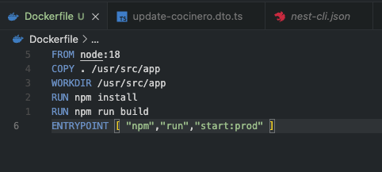
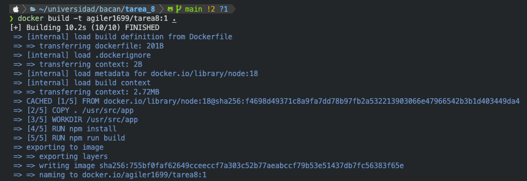
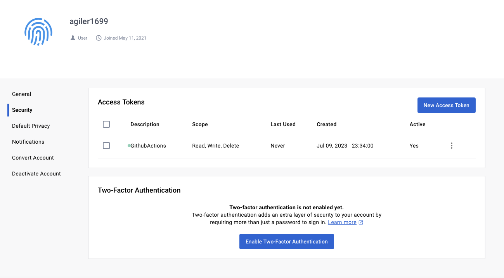
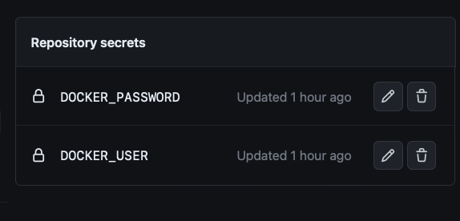
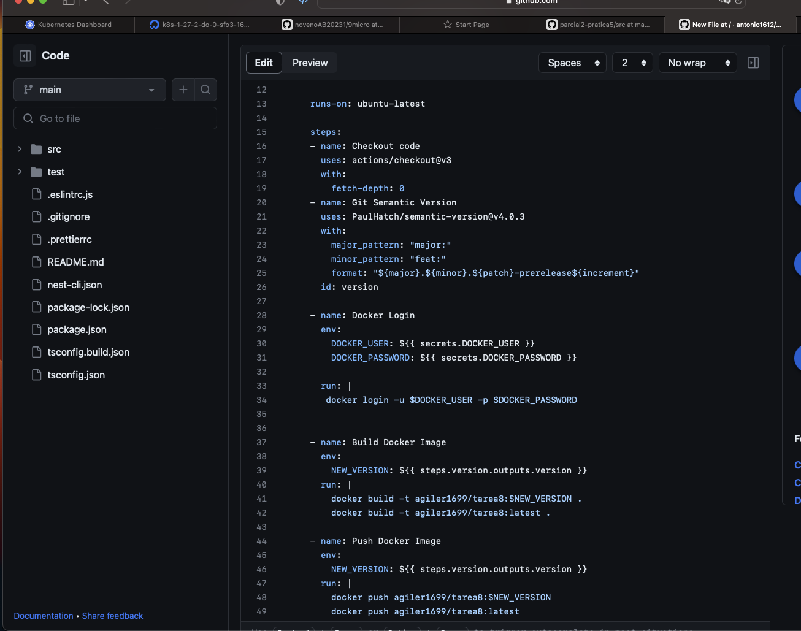
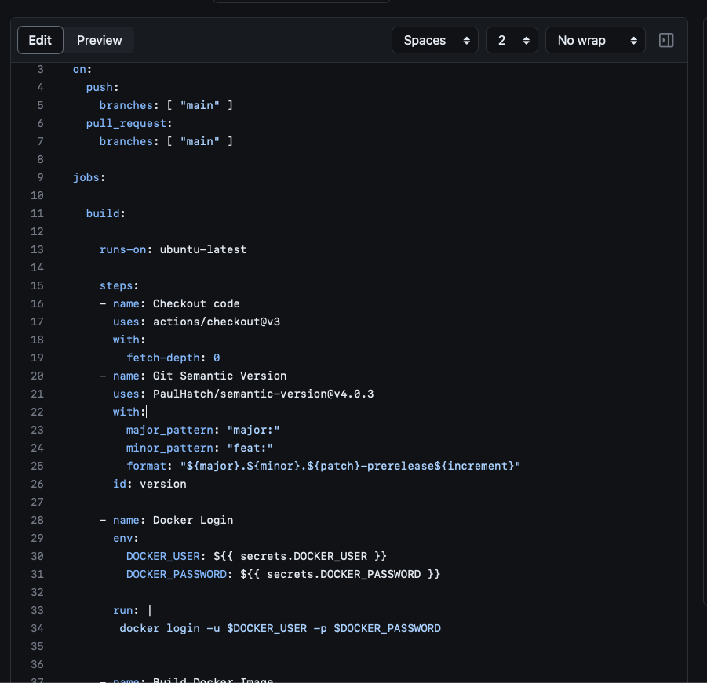
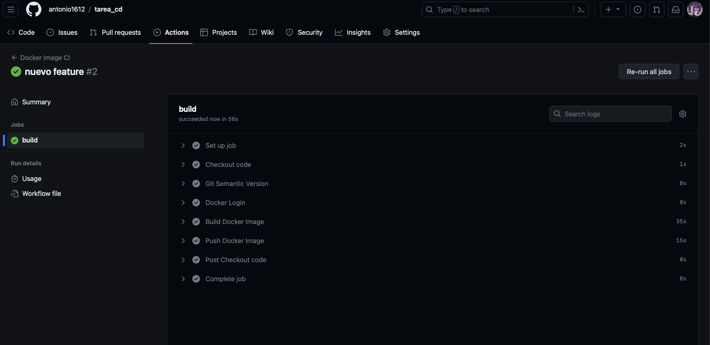
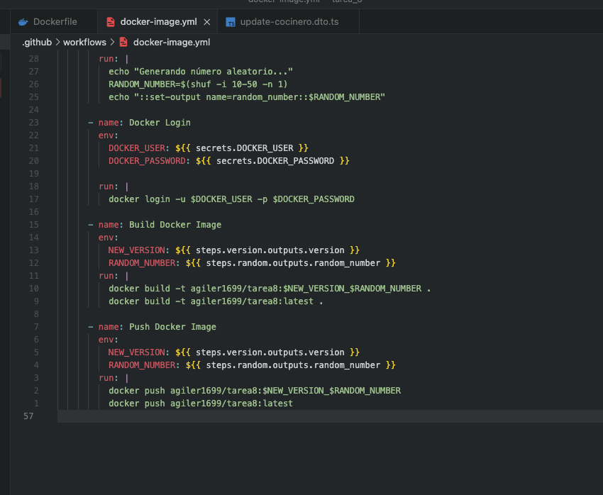
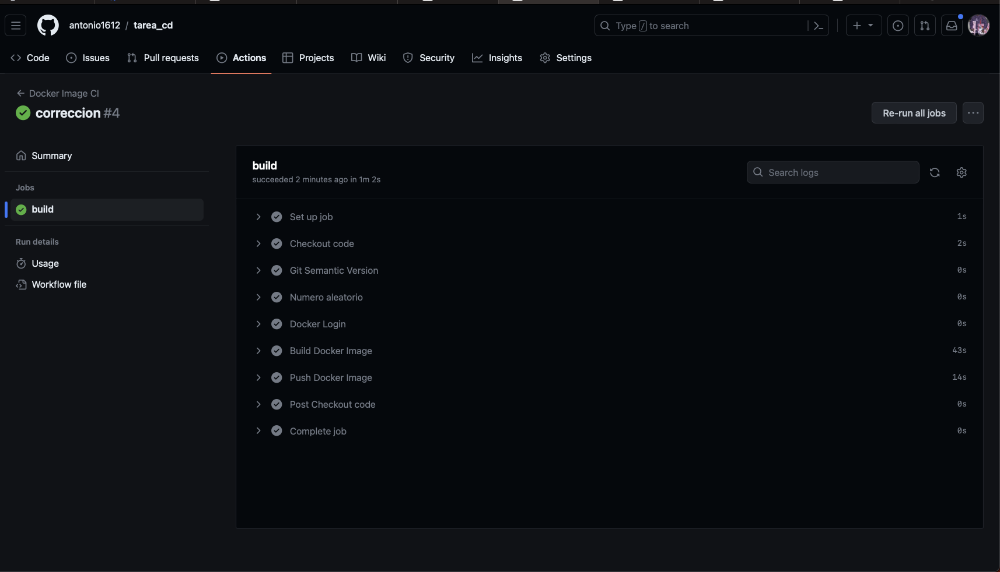
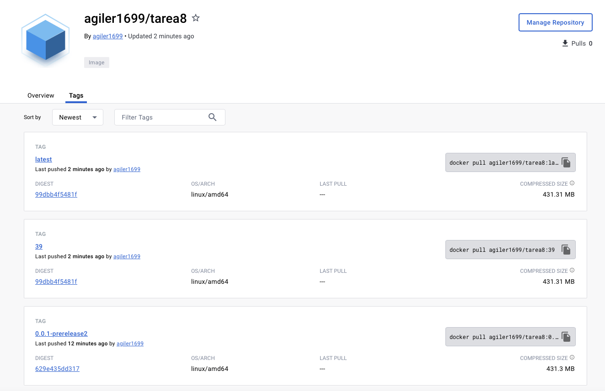

# Evidencias

1. Primero creamos el repositorio de github, subimos el proyecto de nestjs

2. Configuramos un dockerfile para crear la imagen

3. Probamos hacer un build de la imagen de forma local

4. Creamos un token de acceso en DockerHub para poder subir la imagen y configurar los secrets en github

5. Creamos y configuramos el workflow para que se ejecute cuando se realice un push al repositorio en la rama master

6. Hacemos un push de un nuevo feature a la rama master para comprobar que se este realizando el workflow de forma correcta

7. Configuramos el workflow para que ahora se agrege un numero aleatorio a nuestro tag del build de docker

8. Probamos creando un nuevo feature y realizando push a master

9. Verificamos en el dockerhub todas las imagenes que hemos creado y subido

